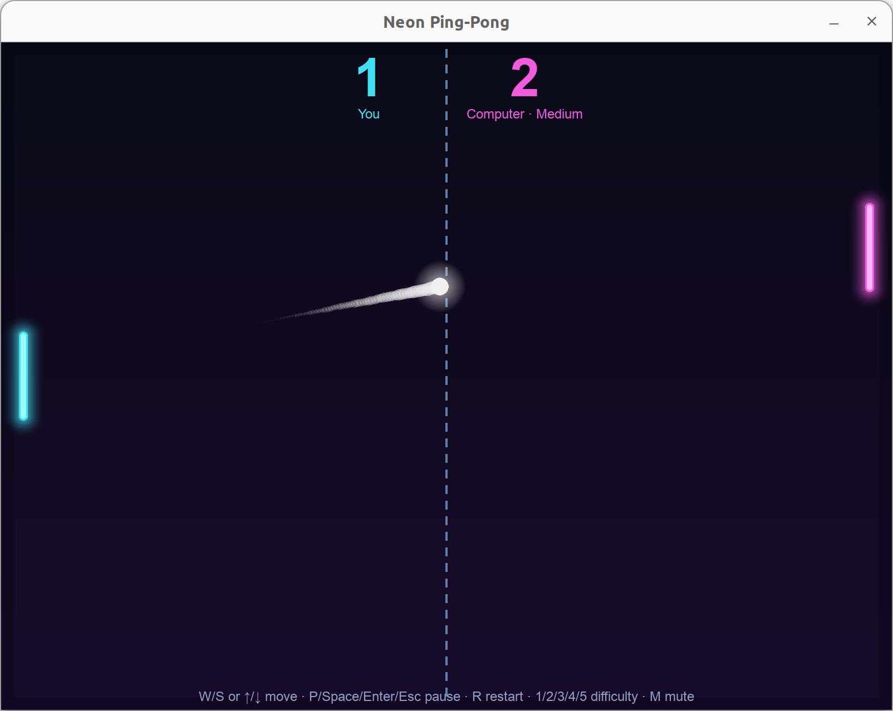

<h1 align="center">🏓 Neon Ping-Pong</h1>

<p align="center">
  
  
  
</p>

<p align="center">
A neon-styled ping-pong game built with Python. Play against the computer or another player. First to 11 points, win by 2.
</p>

<p align="middle">
  
</p>

## ✨ Features

- 🌌 **Neon look**
- 👥 **Two modes**: play against the computer or another player.
- 🤖 **5 difficulty levels** — Easy / Medium / Hard / Expert / Impossible, switchable mid-match.

## 📦 Setup

```bash
pip install -r requirements.txt
```

## ▶️ Run

```bash
python main.py
```

## ⌨️ Controls

### 1 player

| Key | Action |
| --- | --- |
| `W` / `S` or `↑` / `↓` | Move your paddle (left) |
| `Space` or `Enter` | Start game, skip serve countdown, return to menu after a match |
| `P` / `Esc` / `Space` / `Enter` | Pause / resume (`Esc` exits pause back to main menu) |
| `R` | Restart match |
| `1` / `2` / `3` / `4` / `5` | Difficulty level: Easy / Medium / Hard / Expert / Impossible (switchable any time) |
| `M` | Mute / unmute |

### 2 players

| Key | Action |
| --- | --- |
| `↑` / `↓` | Player 1 (left paddle) |
| `W` / `S` | Player 2 (right paddle) |
| `Space` or `Enter` | Start game, skip serve countdown, return to menu after a match |
| `P` / `Esc` / `Space` / `Enter` | Pause / resume (`Esc` exits pause back to main menu) |
| `R` | Restart match |
| `M` | Mute / unmute |

Switch modes from the main menu with `T`.
